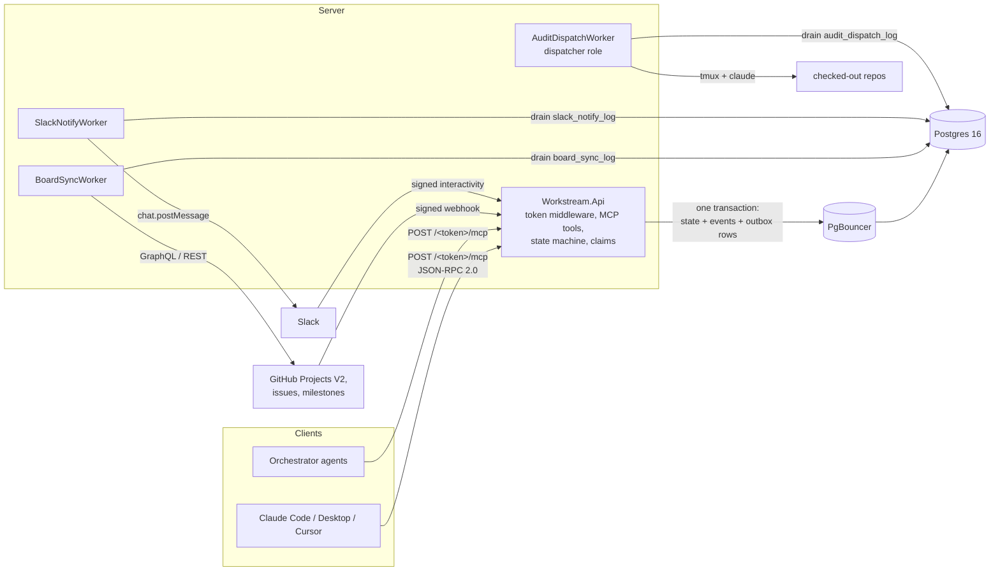

# workstream-mcp

[](https://github.com/ahmad-codex/workstream-mcp/actions/workflows/ci.yml)
[](./LICENSE)
[](https://dotnet.microsoft.com/)
[](https://modelcontextprotocol.io/)

An MCP server that keeps the state of record for work done by AI agents and humans together:
plans, tasks, claims, findings, fix attempts and verdicts, stored in Postgres, mirrored to
GitHub Projects and Slack.

## Why

A common way to coordinate agent work is a markdown plan in the repo: a checklist the agent
reads, edits and commits. That works for one agent in one session. It breaks down when several
agents and people work the same plan at once:

- Two agents pick the same item, because nothing stops them.
- An agent dies mid-task and the item stays "in progress" forever.
- Edits to the file race each other, and the history of who did what lives in git diffs.
- The plan does not show up where the team already looks: the project board and Slack.

workstream-mcp replaces the file with a small service. Agents call MCP tools to claim work,
submit results and record verdicts. Claims are atomic and expire, transitions are checked
against a state graph, every change is written to an append-only event log, and GitHub and
Slack are updated from an outbox so an outage on their side never blocks the agents.

## Features

What the code does today:

- **Atomic claims with TTLs.** `SELECT ... FOR UPDATE SKIP LOCKED` in one transaction, so
  concurrent claimers never get the same task and never block each other. A claim that is not
  refreshed expires and the work returns to the pool. Covered by a 32-claimer concurrency test suite.
- **Data-driven state machine.** Statuses, legal transitions, allowed roles, role TTLs, retry
  caps and board column mappings live in `plan_types.state_graph` (JSONB). Two plan types ship:
  `audit` (find, verify, fix, re-verify) and `development` (implement, review). An illegal
  transition returns `illegal_transition` with `allowed_next`, so the calling model can correct itself.
- **Append-only event log.** Every state change writes an `events` row. Triggers block `UPDATE`
  and `DELETE` on `events` and `verdicts`.
- **GitHub Projects V2 sync.** Tasks become issues (or draft items for repo-less projects) on a
  Projects V2 board, columns follow task status, and audit plans get a milestone. Inbound board
  moves arrive through a signed webhook. Uses a GitHub App.
- **Slack notifications.** Block Kit messages per project channel, threaded per task, with role
  personas for agent posts, and interactive buttons verified with the Slack signing secret.
- **Outboxes.** GitHub and Slack calls are queued in `board_sync_log` and `slack_notify_log`
  inside the request transaction and drained by background workers with retries.
- **URL-as-credential auth.** Each user gets a URL like `https://host/<token>/mcp`. Pasting it
  into an MCP client is the whole setup. Tokens can be rotated; the token is stripped from the
  path and from logs.
- **Audit dispatcher (optional).** `request_audit` queues an audit run; a sidecar container
  clones the repo and starts the project's audit orchestrator in a tmux session with Claude Code.
- **Admin API and CLI.** `/admin/*` endpoints behind a static bearer token for users and
  boards, plus a `workstream-admin` CLI for user management. Projects and plans are set up
  through the admin-gated MCP tools.
- **Stuck-work report.** An hourly job writes counts of expired claims, stale findings and idle
  plans to `stuck_work_reports`.

## Architecture



| Project | Responsibility |
|---|---|
| `src/Workstream.Api` | ASP.NET Core host, token middleware, JSON-RPC endpoint, admin API, webhooks, dispatcher |
| `src/Workstream.Core` | Domain model, state graph parser, `StateMachineService`, claim rules |
| `src/Workstream.Data` | Npgsql + Dapper repositories, outbox, SQL migration runner |
| `src/Workstream.Mcp` | The MCP tool classes and their registration |
| `src/Workstream.GitHub` | GitHub App auth, Projects V2 client, board sync worker |
| `src/Workstream.Slack` | Slack client, Block Kit builders, notify worker, signature check |
| `src/Workstream.Telemetry` | OpenTelemetry setup and metric definitions |
| `tools/workstream-admin` | Operator CLI |
| `deploy/` | Dockerfiles, compose files, migrations, plan-type profiles, Caddy, PgBouncer, Grafana and Prometheus config |

More in [docs/architecture.md](./docs/architecture.md) and [docs/state-machine.md](./docs/state-machine.md).

## Quick start (about 5 minutes)

Needs Docker. This starts Postgres and the API only; GitHub, Slack and the dispatcher stay off.

```bash
git clone https://github.com/ahmad-codex/workstream-mcp.git
cd workstream-mcp
docker compose -f deploy/docker-compose.quickstart.yml up -d --build
curl http://localhost:8080/healthz
# {"ok":true}
```

To skip the local build, run the published image instead:

```bash
WORKSTREAM_IMAGE=ghcr.io/ahmad-codex/workstream-mcp:latest \
  docker compose -f deploy/docker-compose.quickstart.yml up -d --no-build
```

The API applies the SQL migrations on startup, including the `audit` and `development` plan types.

Create a user. The response contains the user's MCP URL once; copy it.

```bash
curl -s -X POST http://localhost:8080/admin/users \
  -H "Authorization: Bearer local-admin-token" \
  -H "Content-Type: application/json" \
  -d '{"githubUsername":"alice","displayName":"Alice","actorType":"human","isAdmin":true}'
# { "user": {...}, "url": "http://localhost:8080/<token>",
#   "mcp_endpoint": "http://localhost:8080/<token>/mcp", "warning": "..." }
```

`isAdmin` lets this user call the setup tools (`create_project`, `create_plan`, ...).
Check the URL:

```bash
curl http://localhost:8080/<token>
# {"ok":true,"actor":{"id":"...","github_username":"alice","is_admin":true},...}
```

Then connect an MCP client (next section) and ask it to create a project, a development plan
and a few tasks, activate the plan, and claim one.

Stop with `docker compose -f deploy/docker-compose.quickstart.yml down` (add `-v` to drop the data).

## Connecting an MCP client

The server speaks MCP over HTTP (JSON-RPC 2.0 POSTs) at `<base>/<token>/mcp`. There are no
extra headers; the token in the path identifies the user.

**Claude Code**

```bash
claude mcp add --transport http workstream http://localhost:8080/<token>/mcp
```

**Claude Desktop** (`claude_desktop_config.json`). Claude Desktop launches stdio servers from
this file, so use the `mcp-remote` bridge (needs Node.js):

```json
{
  "mcpServers": {
    "workstream": {
      "command": "npx",
      "args": ["-y", "mcp-remote", "http://localhost:8080/<token>/mcp"]
    }
  }
}
```

If the server is reachable from the internet over HTTPS, you can instead add the URL as a
custom connector in Claude Desktop's settings.

**Cursor** (`~/.cursor/mcp.json`, or `.cursor/mcp.json` in a project):

```json
{
  "mcpServers": {
    "workstream": {
      "url": "http://localhost:8080/<token>/mcp"
    }
  }
}
```

The URL is a credential. Do not commit it; keep it in user-level config.
See [docs/onboarding.md](./docs/onboarding.md) for the full onboarding flow.

## MCP tools

36 tools. Every response is `{ ok, data, error }`; errors carry a stable `code`
(`stale_claim`, `illegal_transition`, `retry_cap_exceeded`, ...). Full details in
[docs/mcp-tools.md](./docs/mcp-tools.md). Any call may pass `as_agent` to set the role
persona used for Slack posts.

| Group | Tool | What it does |
|---|---|---|
| Discovery | `list_projects` | Projects with active plan counts and the caller's open claims |
| | `list_plans` | Plans of a project, filterable by status, with task counts per status |
| | `get_plan_dashboard` | Status counts, next claimable work, my claims, stuck work, recent events |
| | `get_my_active_work` | Every claim the caller holds |
| Claims | `claim_next_task` | Claim the highest-priority pending task for a role |
| | `claim_specific_task` | Claim one task by id |
| | `claim_next_finding_for_verification` | Audit: claim a finding to verify |
| | `claim_next_finding_for_fix` | Audit: claim a confirmed finding to fix |
| | `claim_next_attempt_for_review` | Reserved; v1 stub |
| | `refresh_claim` | Extend a claim's TTL during long work |
| | `release_claim` | Give work back without submitting |
| Submission | `start_work` | `claimed` to `in_progress` |
| | `submit_findings` | Audit: submit findings for a task |
| | `submit_verification_verdict` | Audit: confirmed, rejected or ambiguous |
| | `submit_attempt` | Submit a code change; enforces the retry cap |
| | `submit_attempt_verdict` | Audit: fix_confirmed, fix_failed or partial |
| | `submit_review_decision` | Development: approved or changes_requested |
| Lifecycle | `mark_task_status` | deferred, blocked, skipped, out_of_scope, needs_human_review |
| | `record_commit` | Attach a commit hash |
| | `create_task` / `create_tasks` | Add tasks to a plan, one or in bulk |
| | `override_verdict` | Force a state change; needs `can_override_verdict` |
| Forensic | `get_event_log` | Event timeline for one entity |
| | `get_stuck_work` | Tasks and attempts past TTL, findings waiting over 24h, idle plans |
| | `export_plan` | Plan snapshot as markdown or JSON |
| | `get_finding` | Full body of one finding: severity, root cause, reproduction, status, claim holder |
| Setup (admin) | `create_project` | New project |
| | `add_project_repo` | Attach a GitHub repo |
| | `add_project_board` | Register a Projects V2 board |
| | `set_project_slack` | Set the Slack channel and bot token reference |
| | `create_plan` | New plan in draft |
| | `add_phase` | Add a phase to a plan |
| | `activate_plan` | Draft to active; enqueues board items |
| | `archive_plan` | Close a plan as Completed or Canceled |
| Audit dispatch (admin) | `request_audit` | Queue audit runs for one or more projects |
| | `cancel_audit` | Ask running audits to stop and clean up |

## Configuration

Environment variables read by the API. Each `_FILE` variant reads the value from a file
(Docker secrets).

| Variable | Required | Purpose |
|---|---|---|
| `WORKSTREAM_DB_CONNECTION` | yes | Npgsql connection string. `Password=__from_secret__` is replaced with the contents of `WORKSTREAM_DB_PASSWORD_FILE` |
| `WORKSTREAM_DB_PASSWORD_FILE` | no | File holding the database password |
| `WORKSTREAM_ADMIN_TOKEN` / `_FILE` | for admin API | Bearer token for `/admin/*`. If unset, admin requests are rejected |
| `WORKSTREAM_PUBLIC_BASE_URL` | no | Base used when returning user URLs. Defaults to the request host |
| `WORKSTREAM_GH_APP_ID` | for GitHub | GitHub App id |
| `WORKSTREAM_GH_INSTALLATION_ID` | for GitHub | App installation id |
| `WORKSTREAM_GH_APP_KEY_PATH` | for GitHub | Path to the App private key (PEM) |
| `WORKSTREAM_GH_WEBHOOK_SECRET` / `_FILE` | for GitHub | Webhook HMAC secret |
| `WORKSTREAM_SLACK_SIGNING_SECRET` / `_FILE` | for Slack buttons | Slack signing secret |
| `WORKSTREAM_ROLE` | no | `api` (default) or `dispatcher` |
| `WORKSTREAM_AUDIT_DISPATCH_ENABLED` | dispatcher | `true` to run the audit dispatcher |
| `WORKSTREAM_AUDIT_DISPATCH_SCRIPT` | dispatcher | Path to `audit-dispatch.sh` |
| `WORKSTREAM_AUDIT_DISPATCH_TIMEOUT` | no | Dispatch script timeout in seconds |
| `WORKSTREAM_OTEL_ENDPOINT` | no | OTLP endpoint for traces and metrics. Unset means telemetry is off. The URL token is redacted from spans |
| `WS_SSH_MCP_HOST` / `WS_SSH_MCP_USER` | dispatcher | Optional test host given to audit runs as an `ssh-host` MCP |

Per-project Slack bot tokens are files under the secrets directory, referenced by
`set_project_slack`. See [docs/slack-setup.md](./docs/slack-setup.md) and
[docs/github-setup.md](./docs/github-setup.md).

## Building from source

```bash
dotnet build
dotnet test tests/Workstream.UnitTests           # no Docker
dotnet test tests/Workstream.IntegrationTests    # Docker (Testcontainers, Postgres 16)
dotnet test tests/Workstream.ConcurrencyTests    # Docker
```

Run the API against your own Postgres:

```bash
export WORKSTREAM_DB_CONNECTION="Host=localhost;Database=workstream;Username=workstream;Password=devpass"
export WORKSTREAM_ADMIN_TOKEN="dev-admin-token"
dotnet run --project src/Workstream.Api
```

## Documentation

- [Architecture](./docs/architecture.md): modules, request lifecycle, concurrency model
- [State machine](./docs/state-machine.md): the state graph format and the two seed plan types
- [MCP tools](./docs/mcp-tools.md): every tool, error codes, `as_agent`
- [Onboarding](./docs/onboarding.md): giving a developer access
- [GitHub setup](./docs/github-setup.md): GitHub App, Projects V2 board, webhooks
- [Slack setup](./docs/slack-setup.md): bot token, channel, interactivity
- [Audit dispatch](./docs/audit-dispatch.md): the dispatcher sidecar
- [Deployment](./docs/deployment.md): production compose, PgBouncer, Caddy, backups
- [Example audit orchestrator](./orchestrators/example/audit-orchestrator.md): a prompt that drives an audit plan end to end
- [Roadmap](./docs/ROADMAP.md): planned work and good first issues
- [Build specification](./workstream-mcp-spec.md): the full design

## Status

Early, version 0.1.0. Known gaps:

- `claim_next_attempt_for_review` is a stub.
- `workstream-admin apply` (declarative bootstrap) only prints the file.
- The stuck-work report is stored but not yet posted to Slack.
- Only the latest `master` is supported; there are no release branches.

See [CHANGELOG.md](./CHANGELOG.md) and the roadmap in [docs/ROADMAP.md](./docs/ROADMAP.md).

## Community

- Questions and ideas: [GitHub Discussions](https://github.com/ahmad-codex/workstream-mcp/discussions)
- Bugs and feature requests: [issues](https://github.com/ahmad-codex/workstream-mcp/issues/new/choose)
- Getting help: [SUPPORT.md](./SUPPORT.md). How decisions are made: [GOVERNANCE.md](./GOVERNANCE.md)
- Security issues: [SECURITY.md](./SECURITY.md)

## Contributing

Start with [CONTRIBUTING.md](./CONTRIBUTING.md) and the good first issues in
[docs/ROADMAP.md](./docs/ROADMAP.md). The repository opens in a dev container or GitHub
Codespaces with the .NET 10 SDK and Postgres ready.

[](https://codespaces.new/ahmad-codex/workstream-mcp)

### Contributors

[](https://github.com/ahmad-codex/workstream-mcp/graphs/contributors)

## License

[MIT](./LICENSE). Copyright 2026 Ahmad Shawar.
